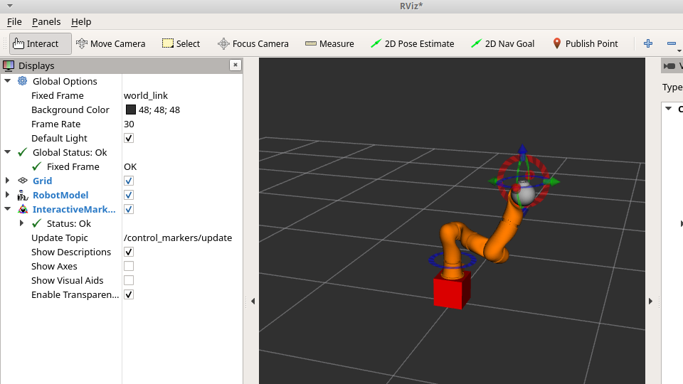
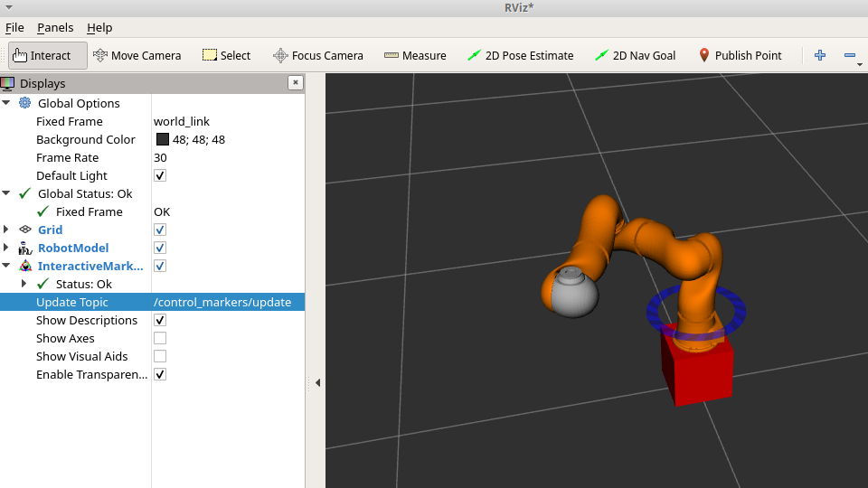

# Cartesian-Control
Implemented differential kinematics on a 7-DOF redundant robot with python and ROS (Robot Operating System) to interactively move the end-effector by dragging around an interactive marker.

In addition, also provided the null-space control, changing the value of the first joint (thus turning the "elbow" of the robot) without affecting the pose of the end-effector (specified above as a primary goal).

## Snapshots
### Cartesian Control

#### Null-Space Control

