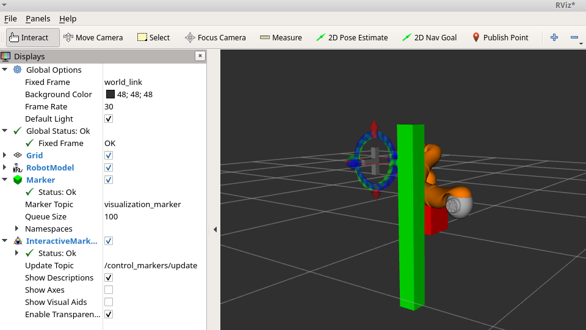

# Robot Arm Motion Planing based on Rapidly-exploring Random Trees
Implemented a Rapidly-exploring Random Tree (RRT) motion planner for the same 7-jointed robot arm with python and ROS (Robot Operating System). This will enable you to interactively maneuver the end-effector to the desired pose without colliding the obstacles.

## Snapshots

