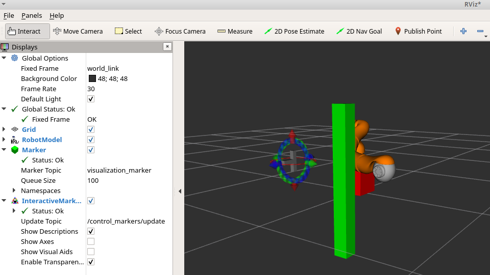

# Robot Arm Motion Planing based on Rapidly-exploring Random Trees
Implement a Rapidly-exploring Random Tree (RRT) motion planner for the same 7-jointed robot arm. This will enable you to interactively maneuver the end-effector to the desired pose collidion-free.

